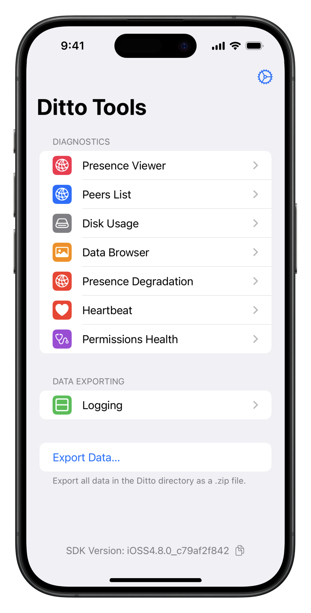
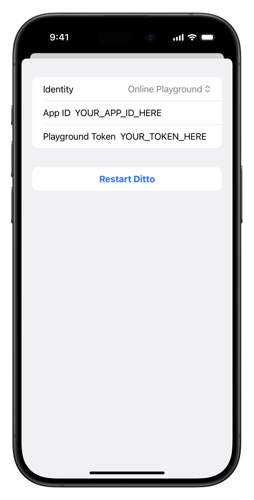

 # DittoSwiftTools

DittoSwiftTools are diagnostic tools for Ditto. You can view connected peers in a graphic viewer and
in a list view, export Ditto data directory and debug logs (locally or to Ditto Portal), browse collections/documents, and see
Ditto's disk usage.

For support, please contact Ditto Support (<support@ditto.live>).

## Requirements
* iOS 14.0+ or tvOS 15.0+ or macOS 11.0+
* Swift 5.0+

## Installation

The recommended approach to use DittoSwiftTools in your project is using the Swift Package Manager.  

1. With your project open in Xcode go to File -> Add Packages, then search using  "github.com/getditto/DittoSwiftTools" to find the DittoSwiftTools package.  

   

2. Select "Add Package"
3. Select which DittoSwiftTools products you would like, then select "Add Package"

*If you are looking for compatibility with Ditto v3, please target the 
[3.0.0 release](https://github.com/getditto/DittoSwiftTools/releases/tag/3.0.0) 
in the Swift Package Manager.*  


## Usage

There are several targets in this package:
- DittoAllToolsMenu
- DittoPresenceViewer  
- DittoPeersList  
- DittoDiskUsage  
- DittoDataBrowser 
- DittoExportLogs  
- DittoExportData    
- DittoPermissionsHealth
- DittoHeartbeat

### All Tools Menu
This tool provides an easy way to integrate all of our tools together in a single handy SwiftUI menu by passing in your `Ditto` instance. We typically recommend this tool for integration, unless you need limited specific tools for your app.


You can use this view in SwiftUI or UIKit

**SwiftUI**

Simply pass your `Ditto` instance in, e.g.:

```swift
AllToolsMenu(ditto: ditto)
```

**UIKit**

Wrap the AllToolsMenu in a UIHostingController, e.g.:

```swift
let vc = UIHostingController(rootView: AllToolsMenu(ditto: ditto))
navigationController?.pushViewController(vc, animated: true)
```
  

### Presence Viewer
The Presence Viewer displays a mesh graph that allows you to see all connected peers within the mesh 
and the transport each peer is using to make a connection.  

   

First, make sure the "DittoPresenceViewer" is added to your Target. Then, use 
`import DittoPresenceViewer` to import the Presence Viewer.  

You can use the Presence Viewer in SiwftUI or UIKit

**SwiftUI**  

Use `PresenceView(ditto: Ditto)` and pass in your Ditto instance to display the mesh graph.  

```swift
import DittoPresenceViewer

struct PresenceViewer: View{

    var body: some View {
        PresenceView(ditto: DittoManager.shared.ditto)
    }
}
```

**UIKit**  

Call [present](https://developer.apple.com/documentation/uikit/uiviewcontroller/1621380-present) 
and pass `DittoPresenceView(ditto: DittoManager.shared.ditto).viewController` as a parameter. 
Set `animated` to `true`.  

```swift
func tableView(_ tableView: UITableView, didSelectRowAt indexPath: IndexPath) {
    present(DittoPresenceView(ditto: DittoManager.shared.ditto).viewController, animated: true) {
        if let selected = tableView.indexPathForSelectedRow {
            tableView.deselectRow(at: selected, animated: true)
        }
    }
}
```

### Peers List
Peers List displays local and connected remote peers within the mesh in a list view, and the transport 
each peer is using to make a connection.

   

You can use the Peers List in SiwftUI or UIKit

**SwiftUI**  

Use `PeersListView(ditto: Ditto)`, passing in your Ditto instance to display the peers list.  

```swift
import DittoSwift

struct PeersListViewer: View {

   var body: some View {
       PeersListView(ditto: DittoManager.shared.ditto)
   }
}
```

**UIKit**  

Pass `PeersListView(ditto: Ditto)` to a [UIHostingController](https://sarunw.com/posts/swiftui-in-uikit/) 
which will return a view controller you can use to present.  

```swift
let vc = UIHostingController(rootView: PeersListView(ditto: DittoManager.shared.ditto))

present(vc, animated: true)
```

### 3. Disk Usage  
Disk Usage allows you to see Ditto's file space usage. In addition to viewing it you can also export the shown data.

   

First, make sure the "DittoDiskUsage" is added to your Target. Then, use `import DittoDiskUsage` 
to import the Disk Usage.  

**SwiftUI**  

Use `DittoDiskUsageView(ditto: Ditto)` and pass in your Ditto instance.  

```swift
import DittoDiskUsage

struct DiskUsageViewer: View {
    var body: some View {
        DittoDiskUsageView(ditto: DittoManager.shared.ditto)
    }
}
```  

**UIKit**  

Pass `DittoDiskUsageView(ditto: Ditto)` to a [UIHostingController](https://sarunw.com/posts/swiftui-in-uikit/) 
which will return a view controller you can use to present.  

```swift
let vc = UIHostingController(rootView: DittoDiskUsageView(ditto: DittoManager.shared.ditto))

present(vc, animated: true)
```

### Data Browser
The Ditto Data Browser allows you to view all your collections, documents within each collection and 
the properties/values of a document. With the Data Browser, you can observe any changes that are made 
to your collections and documents in real time.  

   

   
 
**Standalone App**  
If you are using the Data Browser as a standalone app, there is a button, `Start Subscriptions`, 
you must press in order to start syncing data. If you are embedding the Data Browser into another 
application then you do not need to press `Start Subscriptions`, as you should already have your 
subscriptions running.  

First, make sure the "DittoDataBrowser" is added to your Target. Then, use `import DittoDataBrowser` 
to import the Data Browser.  

**SwiftUI**  

Use `DataBrowser(ditto: Ditto)` and pass in your Ditto instance to display the Data Browser.  

```swift
import DittoDataBrowser

struct DataBrowserView: View {
    var body: some View {
       DataBrowser(ditto: DittoManager.shared.ditto)
    }
}
```  

**UIKit**  

Pass `DataBrowser(ditto: Ditto)` to a [UIHostingController](https://sarunw.com/posts/swiftui-in-uikit/) 
which will return a view controller you can use to present.   

```swift
let vc = UIHostingController(rootView: DataBrowser(ditto: DittoManager.shared.ditto))

present(vc, animated: true)
```  

### Logging and Export Logs
#### Logging Level  

The LoggingDetailsView allows you to choose the Ditto logging level at runtime and toggle whether logging is enabled. Changes made through the LoggingDetailsView are automatically persisted using UserDefaults, ensuring the selected log level and enabled status are restored when the app restarts.

   


#### SwiftUI

To integrate the LoggingDetailsView into your app, simply pass your Ditto instance to the view. The picker will display the available log levels, and the toggle will allow enabling or disabling logging.

```swift
import DittoExportLogs
import DittoSwift
import SwiftUI

struct LoggingDetailsViewer: View {
    var body: some View {
        LoggingDetailsView(ditto: <ditto instance>)
    }
}
```

You can embed the LoggingDetailsView into your app’s navigation hierarchy or display it as a modal view. For example:

```swift
NavigationView {
    VStack {
        LoggingDetailsView()
    }
    .navigationTitle("Logging Settings")
}
```

Or present it as a sheet:

```swift
.sheet(isPresented: $isPresented) {
    LoggingDetailsView()
}
```
        
#### Export Logs  
Allows you to export a file of the logs from your applcation as a zip file.  

   

First, make sure the "DittoExportLogs" is added to your Target. Then, use `import DittoExportLogs` 
to import the Export Logs.

**SwiftUI**  

Use `ExportLogs()` to export the logs. It is recommended to call `ExportLogs` from within a [sheet](https://developer.apple.com/documentation/swiftui/view/sheet(ispresented:ondismiss:content:)).  

```swift
.sheet(isPresented: $isPresented) {
    ExportLogs()
}
```  

**UIKit**  

Pass `ExportLogs()` to a [UIHostingController](https://sarunw.com/posts/swiftui-in-uikit/) 
which will return a view controller you can use to present.  

```swift
let vc = UIHostingController(rootView: ExportLogs())

present(vc, animated: true)
```

#### Export Logs to Portal

   

Export Logs to Portal allows you to request that logs from your application be uploaded to the Ditto Portal associated with your app ID. This is useful for remote diagnostics and support.

When you trigger an export to Portal, the tool updates a special Ditto collection that signals the Ditto cloud service to collect logs from your device. The logs will be available in the Ditto Portal for your app.

First, make sure the "DittoExportLogs" is added to your Target. Then, use `import DittoExportLogs` to import the Export Logs to Portal functionality.

**Programmatic API**

You can also trigger log upload programmatically from anywhere in your app using the public API:

```swift
import DittoExportLogs
import DittoSwift

Task {
    do {
        try await LogUploader.uploadLogsToPortal(ditto: ditto)
        print("Log upload requested successfully")
    } catch {
        print("Failed to request log upload: \(error)")
    }
}
```

**SwiftUI**

Use `ExportLogsToPortalView(ditto:onDismiss:)` to request log upload. Pass your Ditto instance and a dismiss callback. It is recommended to present this from within a [sheet](https://developer.apple.com/documentation/swiftui/view/sheet(ispresented:ondismiss:content:)).

```swift
import DittoExportLogs
import DittoSwift

.sheet(isPresented: $showExportToPortal) {
    ExportLogsToPortalView(ditto: ditto) {
        showExportToPortal = false
    }
}
```

**UIKit**

Pass `ExportLogsToPortalView(ditto:onDismiss:)` to a [UIHostingController](https://sarunw.com/posts/swiftui-in-uikit/) which will return a view controller you can use to present.

```swift
let vc = UIHostingController(
    rootView: ExportLogsToPortalView(ditto: ditto) {
        // Dismiss logic
        self.dismiss(animated: true)
    }
)

present(vc, animated: true)
```


### Export Data Directory

ExportData allows you to export the Ditto store directory as a zip file.


**SwiftUI**

Use `ExportData(ditto: ditto)` to get `UIActivityViewController` and call it within a  [sheet](https://developer.apple.com/documentation/swiftui/view/sheet(ispresented:ondismiss:content:)).

```swift
.sheet(isPresented: $isPresented) {
    ExportData(ditto: ditto)
}
```  

**UIKit**

Pass `UIActivityViewController` (return value of `ExportData(ditto: ditto)`) to [UIHostingController](https://sarunw.com/posts/swiftui-in-uikit/) 
which will return a view controller you can use to present.

```swift
let vc = UIHostingController(rootView: ExportData(ditto: ditto))

present(vc, animated: true)
```

### Presence Degradation Reporter

Tracks the status of your mesh, allowing to define the minimum of required peers that needs to be connected. Provides a callback function that will allow you to monitor the status of the mesh.


You can use the Presence Degradation Reporter in SiwftUI or UIKit

data provided in callback
```swift
settings: Settings
struct Settings {
    let expectedPeers: Int
    let reportApiEnabled: Bool
    let hasSeenExpectedPeers: Bool
    let sessionStartedAt: String
}
```

**SwiftUI**  

Use `PresenceDegradationView(ditto: DittoManager.shared.ditto!) { expectedPeers, remotePeers, settings in //handle data}`, passing in your Ditto instance to display the peers list.  

```swift
import DittoPresenceDegradation

struct PresenceDegradationViewer: View {
    
    var body: some View {
        PresenceDegradationView(ditto: <diito>) { expectedPeers, remotePeers, settings in
            //handle data
        }
    }
}
```

**UIKit**  

Pass `PresenceDegradationView(ditto: <ditto>)` to a [UIHostingController](https://sarunw.com/posts/swiftui-in-uikit/) 
which will return a view controller you can use to present.  

```swift
let vc = UIHostingController(rootView: PresenceDegradationView(ditto: <diito>))

present(vc, animated: true)
```

### Permissions Health

Permissions Health allows you to see the status of ditto's required services and permissions.

Example: Wi-Fi, Bluetooth, Missing Permissions.


**SwiftUI**

```swift
import DittoPermissionsHealth

struct PermissionsHealthViewer: View {
    var body: some View {
        PermissionsHealth()
    }
}
```

**UIKit**

Pass `UIActivityViewController` (return value of `PermissionsHealth()`) to [UIHostingController](https://sarunw.com/posts/swiftui-in-uikit/) 
which will return a view controller you can use to present.

```swift
let vc = UIHostingController(rootView: PermissionsHealth())

present(vc, animated: true)
```

### Heartbeat

The Ditto Heartbeat tool allows you to monitor, locally or remotely, the peers in your mesh. It allows you to regularly report data and health of the device.

**Configure Heartbeat**

These are the values you need to provide to the Heartbeat:
1. `id` - Unique value that identifies the device.
2. `secondsInterval` - The frequency at which the Heartbeat will scrape the data.
3. `metadata` (optional) - Any metadata you want to attach to this heartbeat.
4. `healthMetricsProviders` (optional) - Any `HealthMetricProvider`s you want to use with this heartbeat. These can be from DittoSwiftTools e.g. `BluetoothManager` from `DittoPermissionsHealth` or custom tools.
5. `publishToDittoCollection` a flag to determine whether to publish the heartbeat data as a Ditto collection. Defaults to `true`.

There is a `DittoHeartbeatConfig` struct you can use to construct your configuration.

```swift
// Provided with the Heartbeat tool
public struct DittoHeartbeatConfig {
    public var id: String
    public var secondsInterval: Int
    public var metadata: [String: Any]?
    public var healthMetricProviders: [HealthMetricProvider]
    public var publishToDittoCollection: Bool

    public init(id: String,
                secondsInterval: Int,
                metadata: [String : Any]? = nil,
                healthMetricProviders: [HealthMetricProvider] = [],
                publishToDittoCollection: Bool = true) {
        self.id = id
        self.secondsInterval = secondsInterval
        self.metadata = metadata
        self.healthMetricProviders = healthMetricProviders
        self.publishToDittoCollection = publishToDittoCollection
    }
}
```

This tool generates a `DittoHeartbeatInfo` object with the given data:
```swift
public struct DittoHeartbeatInfo: Identifiable {
    public var id: String
    public var schema: String
    public var secondsInterval: Int
    public var lastUpdated: String
    public var sdk: String
    public var presenceSnapshotDirectlyConnectedPeersCount: Int { presenceSnapshotDirectlyConnectedPeers.count }
    public var presenceSnapshotDirectlyConnectedPeers: [DittoPeerConnection]
    public var metadata: [String: Any]
    public var healthMetrics: [String: HealthMetric]
}

public struct DittoPeerConnection {
    public var deviceName: String
    public var sdk: String
    public var isConnectedToDittoCloud: Bool
    public var bluetooth: Int
    public var p2pWifi: Int
    public var lan: Int
    public var peerKey: String
}

// See DittoHealthMetrics
public struct HealthMetric {
    public var isHealthy: Bool
    public var details: [String: String]
}
```

You can either use the provided UI from this tool or you can read the `DittoHeartbeatInfo` data and create your own UI/use the data as you please.

**Use provided UI:**

**SwiftUI**  

Use `HeartbeatView(ditto: dittoModel.ditto!, config: heartbeatConfig)`, passing in your Ditto instance and your DittoHeartbeatConfig object.  

```swift
import DittoHeartbeat

struct HeartbeatViewer: View {
    var body: some View {
        HeartbeatView(ditto: <ditto>, config: <heartbeatConfig>)
    }
}
```

**UIKit**  

Pass `HeartbeatView(ditto: <ditto>, config: <heartbeatConfig>)` to a [UIHostingController](https://sarunw.com/posts/swiftui-in-uikit/) 
which will return a view controller you can use to present.  

```swift
let vc = UIHostingController(rootView: HeartbeatView(ditto: <ditto>, config: <heartbeatConfig>))
```

**Read data only:**

Create a `HeartbeatVM(ditto: <ditto>` object and then call `startHeartbeat(config: DittoHeartbeatConfig, callback: @escaping HeartbeatCallback)`. You can access the data in the callback of `startHeartbeat`
```swift
var heartBeatVm = HeartbeatVM(ditto: DittoManager.shared.ditto!)
heartBeatVm.startHeartbeat(config: DittoHeartbeatConfig(secondsInterval: Int, metadata: metadata: [String:Any]? )) { heartbeatInfo in
        //use data
} 
```

## Ditto Tools Example App
The [Ditto Tools Example App](https://github.com/getditto/DittoSwiftTools/tree/main/DittoToolsApp) 
included in this repo allows you to try the DittoSwiftTools package in a standalone app. Open 
DittoToolsApp.xcodeproj in Xcode and build to a simulator or device.   

<div align="center">
    <figure>
        
        <figcaption>Ditto Tools app displaying the list of available tools.</figcaption>
    </figure>
 </div>

In the `CONFIGURATION` section of the tools list, click Change Identity to configure and start, or 
restart, the Ditto session. Select `Online Playground`, `Offline Playground`, or `Online 
With Authentication` in the Identity picker. Then add the appropriate `App ID` and other values 
from your Ditto portal app and click `Restart Ditto`.  

<div align="center">
    <figure>
        
        <figcaption>Ditto Tools app showing the configuration details.</figcaption>
    </figure>
 </div>

This will initialize the Ditto instance and enable you to try the different features.   


## Troubleshooting


### Could not resolve package dependencies for `Swift tools`  

```
xcodebuild: error: Could not resolve package dependencies:
  package at 'http://github.com/getditto/DittoSwiftTools' @ 0ae82dcc1031d25ce5f6f20735b666312ecb2e53 is using Swift tools version 5.6.0 but the installed version is 5.5.0 in http://github.com/getditto/DittoSwiftTools  
```

Solution: Update to the latest version of XCode to get new Swift versions.

## Contact

Send us an email at support@ditto.live or [submit a form](https://www.ditto.live/about/contact). 

## License (MIT)
Copyright © 2023 DittoLive

Permission is hereby granted, free of charge, to any person obtaining a copy of this software and associated documentation files (the “Software”), to deal in the Software without restriction, including without limitation the rights to use, copy, modify, merge, publish, distribute, sublicense, and/or sell copies of the Software, and to permit persons to whom the Software is furnished to do so, subject to the following conditions:

The above copyright notice and this permission notice shall be included in all copies or substantial portions of the Software.

THE SOFTWARE IS PROVIDED “AS IS”, WITHOUT WARRANTY OF ANY KIND, EXPRESS OR IMPLIED, INCLUDING BUT NOT LIMITED TO THE WARRANTIES OF MERCHANTABILITY, FITNESS FOR A PARTICULAR PURPOSE AND NONINFRINGEMENT. IN NO EVENT SHALL THE AUTHORS OR COPYRIGHT HOLDERS BE LIABLE FOR ANY CLAIM, DAMAGES OR OTHER LIABILITY, WHETHER IN AN ACTION OF CONTRACT, TORT OR OTHERWISE, ARISING FROM, OUT OF OR IN CONNECTION WITH THE SOFTWARE OR THE USE OR OTHER DEALINGS IN THE SOFTWARE.
``
